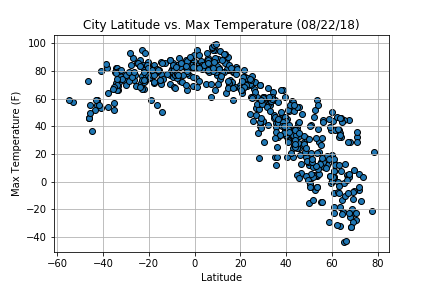
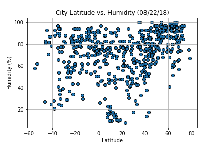
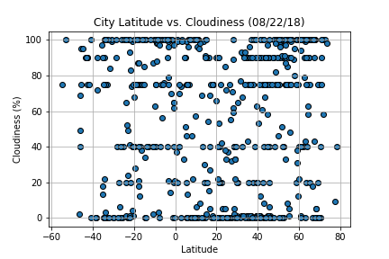
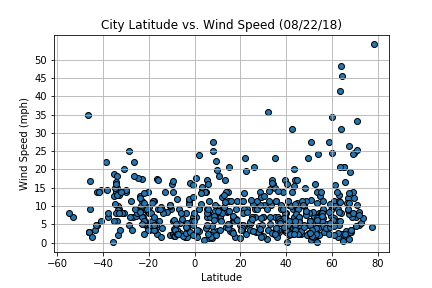

# Python API Challenge - WeatherPy

A minimum of 500 unique (non-repeat) cities were sampled based on latitude and longitude to assess weather conditions. Analysis is available to [view](WeatherPy.ipynb).To determine if weather conditions differ at the equator, the following plots were generated:

**Latitude vs. Max Temperature**  
Cities located between the latitudes of -20 to 12 report the most elevated temperatures with 75 degrees Fahrenheit and above.

**Latitude vs. Humidity (%)**  
Cities located between the latitudes of 45 to 60 report the most events with 80% humidity and above.

**Latitude vs. Cloudiness (%)**  
There is no correlation with latitude and cloudiness.

**Latitude vs. Wind Speed (mph)**  
There is no correlation with latitude and wind speeds. As latitude decreases, cities observe less wind events.

